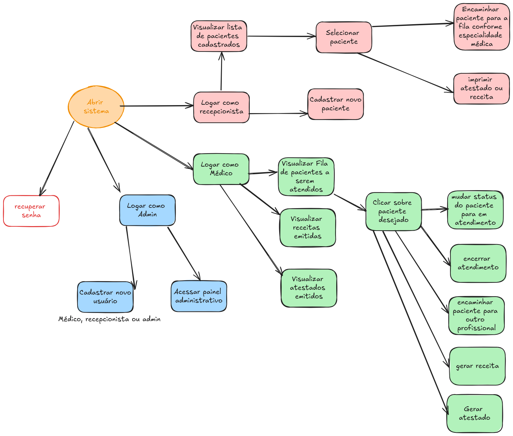
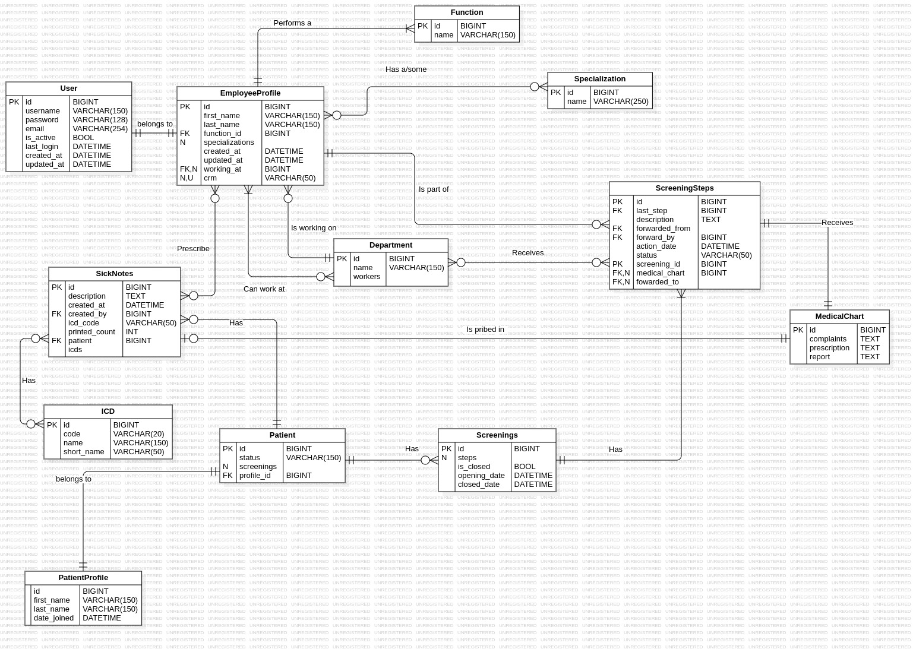
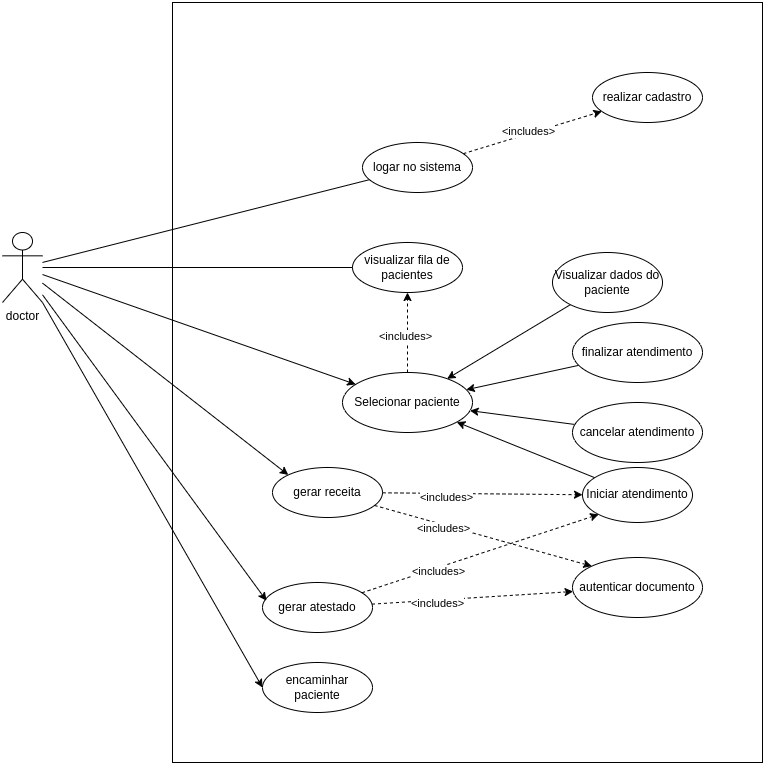
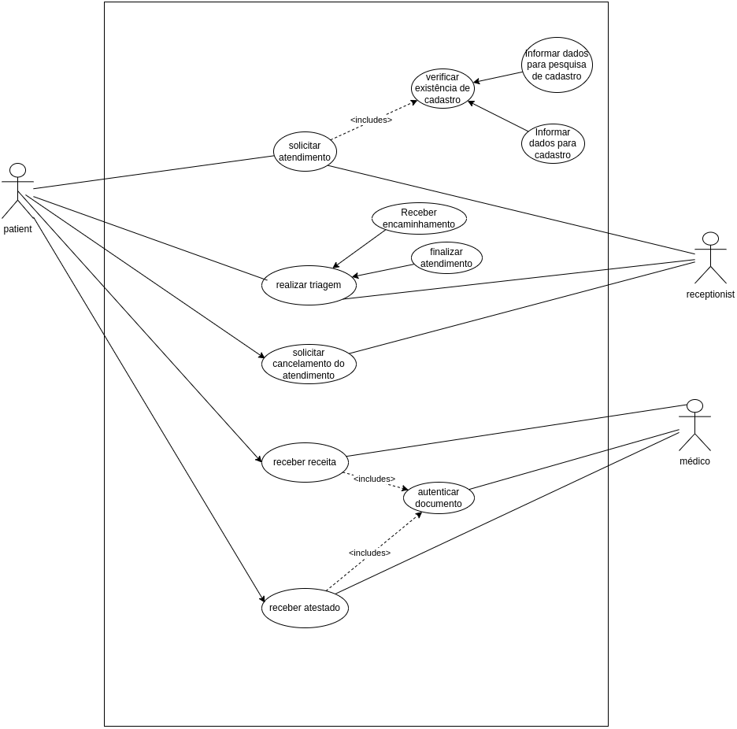
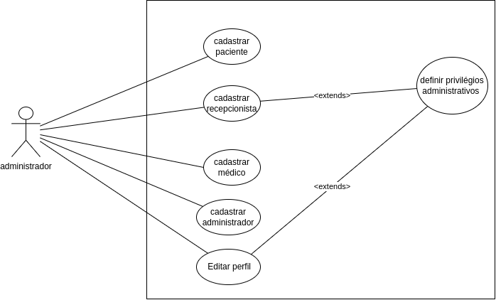

# Patient Management
[![Issues][issues-shield]][issues-url]

O Projeto consistirá em um sofware gerenciador de ciclo de vida de um paciente dentro de um consultório, envolvendo todas as etapas de uma atendimento, incluindo o início e encerramento do mesmo. 

O software terá como agentes o paciente, o(a) recepcionista, o(a) médico(a) e  o(a) administrador(a).

## Engenharia de requisitos 
 
O presente documento busca , atraves do uso de engenharia de software, em específico com o uso de engenharia de requisitos, elicitar as funcionalidades a serem desenvolvidas no sistema. 

Ao final do presente documento teremos uma visão holística de todo o sistema a ser envolvido, finalizando com uma representação do mesmo por meio de um design de alta fidelidade.

### Diagrama sequencial solto 

Essa diagramação foi desenvolvida de maneira livre, com o intuido de representar possíveis ações gerais do sistema. 
<figure markdown>

</figure>

### Diagrama ER  

O diagrama de entidade-relacionamento representa, por meio de uma abordagem orientada a entidades, os relacionamentos e interações entre essas. 
<figure markdown>

</figure>
### Diagramas de Casos de uso 

Um diagrama de caso de uso representa uma funcionalidade específica do sistema, mostrando as possibilidades de ações de maneira sequencial. 

#### UC1 – Doctor Flow
<figure markdown>

</figure>

#### UC2 – Receptionist Flow
<figure markdown>

</figure>

#### UC3 – Administrador Flow
<figure markdown>

</figure>

[issues-shield]: https://img.shields.io/github/issues/devpillow-org/patient-management?style=for-the-badge
[issues-url]: https://github.com/devpillow-org/patient-management/issues